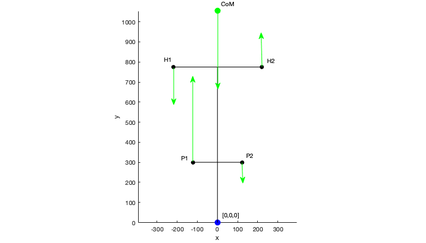

# handlebar-force-solver

## Author

Ross Wilkinson, Ph.D.

## Overview

This repository contains an example of how to estimate left and right handlebar forces during standing cycling using force and torque equilibrium equations.

## Background

Our recent evidence shows that vertical accelerations of the rider's centre of mass (CoM) are substantial when cycling off the saddle. These accelerations are caused by interaction forces between the rider and bicycle at the pedals and handlebar. It is more common for biomechanical studies of cycling to measure forces at the left and right pedal, but is less common to measure handlebar forces. Instrumenting the handlebars of a bicycle or cycling ergometer in such a way that forces acting on left and right hands of the rider can be separated is costly and difficult. Thus, a computational method for estimating handlebar forces may be a valuable resource for researchers interested in the biomechanics of standing cycling.

Vertical handlebar forces can be estimated by collecting data on the position of the rider and forces generated on the left and right pedals. This data can then be used to solve force and torque equilibrium equations of the bicycle-rider system in the frontal plane.

## Example

The provided example shows how vertical acceleration of the rider's CoM reduces peak pulling forces at the handlebar during standing cycling.
